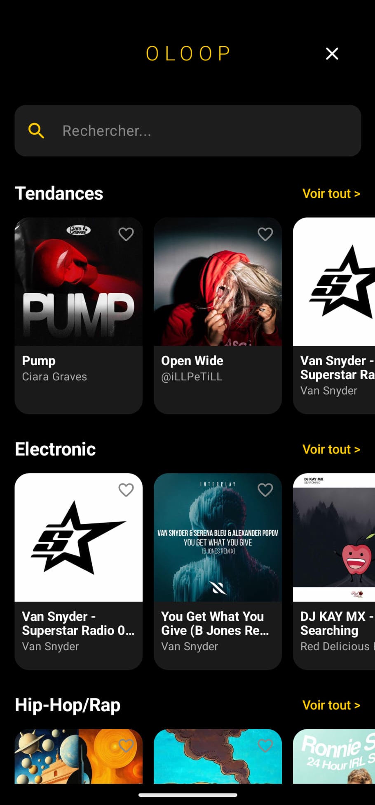
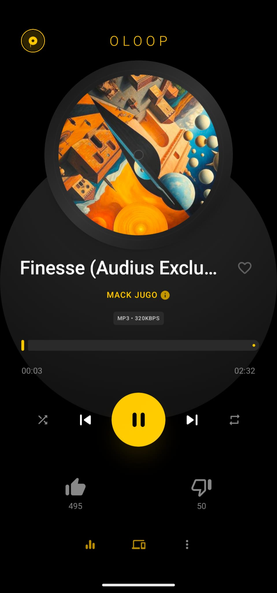
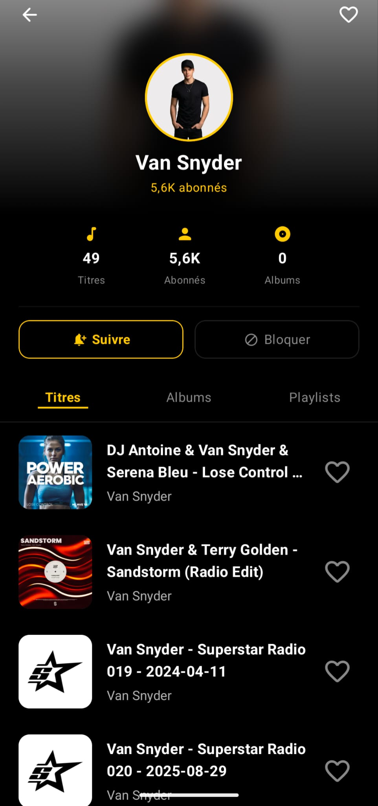

## Aperçu de l'application

  &nbsp;&nbsp;&nbsp;&nbsp;&nbsp;&nbsp;&nbsp;&nbsp;&nbsp;&nbsp;&nbsp;&nbsp;
  &nbsp;&nbsp;&nbsp;&nbsp;&nbsp;&nbsp;&nbsp;&nbsp;&nbsp;&nbsp;&nbsp;&nbsp;
  

# Oloop - Hybrid Music Player (Local & Audius Streaming)

Oloop is a modern Android application built entirely with Jetpack Compose. It combines local audio file playback with decentralized streaming via the Audius platform. It features a premium dark design with gold accents and offers a polished user experience (rotating vinyl, cover art animations).

---

## Main Features

### Local Library

* **Device Scan:** Automatic detection of local audio files (MP3, FLAC, M4A, etc.) via Android MediaStore.
* **Robust Audio Player:** Powered by Media3 / ExoPlayer running in the background via a MediaSessionService.
* **Complete Controls:** Play/pause, next/previous track, seek, shuffle, and repeat modes.
* **Equalizer:** Direct access to the system audio equalizer.

### Decentralized Streaming (Audius)

* **Dynamic Trends:** Explore weekly trending tracks, globally or filtered by genre (Electronic, Rock, Pop, Hip-Hop...).
* **Top Artists of the Week:** Exclusive algorithm that ranks the most active artists of the week based on their trending presence and follower count.
* **Global Search:** Quick search for tracks or artists on the Audius platform.
* **Favorites & Blocking:** Mark your favorite tracks for quick access or block unwanted artists (permanent filter).

### Home Screen Widget

* **Glance Widget:** Interactive widget displaying the currently playing track, artist, and quick control buttons (Play/Pause, Next, Previous) synchronized in real time with the playback service.

### Local Cache & Optimizations

* **Intelligent Caching:** Local caching of Audius API data (SharedPreferences + JSON) to save bandwidth and speed up rendering (automatic invalidation upon expiration).
* **Smart Artwork Management:** Optimal preferred cover art resolution (480x480) and automatic fallback to Audius mirror servers in case of host unavailability.

---

## Technical Stack

| Component | Technology | Version / Configuration |
| --- | --- | --- |
| **Language** | Kotlin | `2.3.20` |
| **UI Framework** | Jetpack Compose | `BOM 2026.03.00` |
| **Playback Engine** | Media3 ExoPlayer | `1.10.0` |
| **Image Loading** | Coil | `2.7.0` |
| **Network** | Retrofit + OkHttp | `2.11.0` / `4.12.0` |
| **Widget** | Jetpack Glance | `1.1.1` |
| **Java Versioning** | Java 17 | JVM Target `11` |
| **Compatibility** | Min SDK: `API 24` (Android 7.0) | Target SDK: `API 36` (Android 16) |
---

